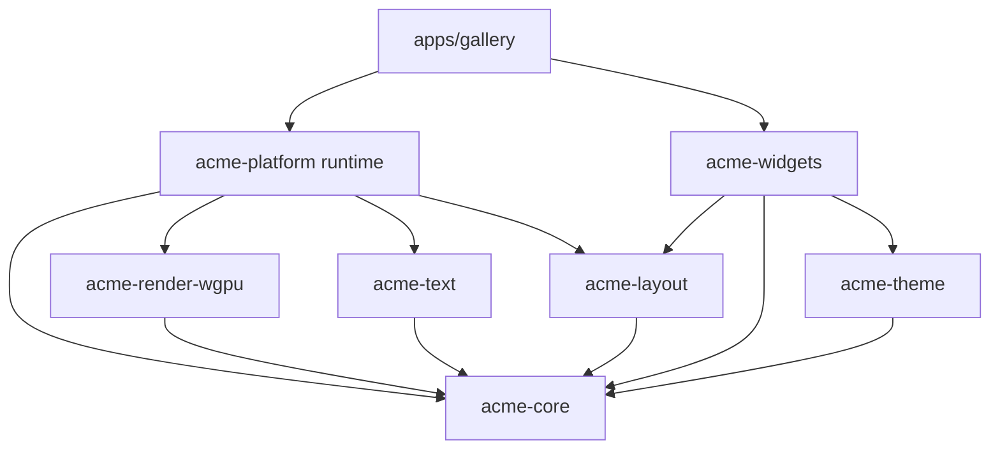

# AcmeUI Native v0.1 Blueprint

Status: implementation blueprint, revised after independent review.

## Functional scope

The v0.1 Windows MVP owns a real resizable winit window, a recoverable wgpu
surface, DPI-safe coordinates, retained keyed nodes, Taffy layout, cosmic-text
shaping with system CJK fallback, scene commands for rectangles/borders/clips/text,
pointer and keyboard focus routing, semantic light/dark themes, the Label, Button,
Card, Separator and ScrollView widgets, and an interactive Gallery.

TextInput, clipboard editing, manually validated Traditional Chinese IME,
AccessKit integration, IconButton, Badge, Spinner and cross-platform claims are
deferred. The runtime may translate IME events and expose a caret rectangle, but
v0.1 must not claim working Traditional Chinese IME.

## Ownership and dependency direction

Platform, wgpu, Taffy and cosmic-text types stay behind their crate boundaries.
`acme-core` is the shared pure-data contract and never depends on those libraries.
The renderer consumes framework-owned prepared-glyph and atlas-upload descriptors;
neither cosmic-text nor wgpu resource types cross that adapter boundary.

## Function and type inventory

| Crate | New public contract | Single responsibility and acceptance |
|---|---|---|
| core | typed logical/physical geometry, `ScaleFactor`, `Color`, `NodeId`, `WidgetKey`, `DirtyFlags` | Checked DPI conversion; finite geometry; opaque stable IDs. |
| core | `ViewNode`, `RetainedTree`, `ReconcileReport` | Keyed mount/reconcile/remove; preserve IDs; propagate only required dirtiness. |
| core | `PaintCommand`, `Scene`, `ClipStack` | Rect, rounded rect, border, text and balanced intersecting clips. |
| core | pointer/key/IME events, hit-test path, dispatcher, `FocusManager` | capture-target-bubble order; stoppable propagation; traversal skips disabled nodes; IME architecture only. |
| theme | `Theme`, semantic color/spacing/radius/typography tokens | Complete validated light/dark palettes; widgets consume tokens, not raw colors. |
| layout | `LayoutStyle`, `LayoutEngine`, `LayoutSnapshot`, `ScrollMetrics` | Map retained IDs privately to Taffy; row/column/stack/scroll; injectable text measurement. |
| text | `FontSystem`, `TextStyle`, `TextLayout`, `TextMeasurer`, atlas preparation data | Shape and measure CJK/emoji without panic; dynamically resolve Windows fallback fonts; no public GPU type. |
| render-wgpu | `Renderer`, `RendererConfig`, `SurfaceStatus`, `RenderError`, diagnostics | Resize/suspend/reconfigure; classify lost/outdated/timeout/OOM; batch scene primitives and text. |
| platform | `Application`, `Runtime`, `WindowConfig`, internal event translator | Own winit lifecycle and runtime orchestration; expose no winit types publicly. |
| widgets | row/column/stack, `Label`, `Button`, `Card`, `Separator`, `ScrollView` builders | Declarative view descriptions; token-based visuals; pointer and Enter/Space activation. |
| devtools | frame/runtime counters | Observable layout, paint, batching and recovery diagnostics. |
| gallery | executable Gallery | Real window demonstrating CJK/emoji, widgets, scroll, focus, resize and theme switching. |

## Per-unit contracts

Every constructor rejects or normalizes non-finite input without panicking.
Logical/physical conversion requires a positive finite scale and has explicit
rounding. Reconciliation rejects duplicate sibling keys, preserves IDs for equal
keys across reorder, removes descendants atomically, and clears stale focus or
capture. Layout returns framework-owned rectangles keyed by `NodeId`. Text fallback
uses discovered system fonts and replacement glyphs when necessary. Rendering
suspends at zero size and treats OOM as fatal while recoverable surface errors
request reconfiguration. Widget state is message-driven and uses semantic tokens.

Each significant unit requires happy-path, boundary and failure/invalid-input tests.
The detailed cases are the matrices in `test.md` plus unit tests next to each crate.

## Hook record and impact rules

- `pre_blueprint_hook`: scanned every existing Rust source and manifest; all were
  foundation stubs, so no non-trivial reference implementation exists to expand.
- `on_reference_detected_hook`: winit, wgpu, Taffy and cosmic-text stay wrapped;
  their public APIs are referenced only through adapters.
- `on_class_added_hook` / `on_method_added_hook`: in Rust, new structs/enums/traits
  and their impl methods update the inventory above.
- `pre_implementation_hook`: crate dependency direction and public-type leakage are
  checked before integration.
- `post_update_hook`: targeted crate tests run after each owned slice; downstream
  crates are checked when a shared contract changes.
- `visualization_hook`: the final implemented graph replaces this planned graph in
  `final.md`.

## Acceptance matrix

- Automated gates: format, workspace check, clippy with warnings denied, and all tests.
- Gallery gate: launches a persistent real window and is manually exercised for
  resize, minimize/restore, theme toggle, scrolling, pointer activation and
  Tab/Shift+Tab/Enter/Space operation.
- DPI gate: logical layout, rendering and hit testing remain aligned at 100, 125,
  150 and 200 percent.
- Recovery gate: injected or deterministic surface-loss transition reconfigures and
  renders a subsequent frame.
- Text gate: English, Traditional Chinese and emoji shape with documented fallback;
  no IME support claim is made without separate manual evidence.
- Evidence gate: Gallery screenshot and repeatable steps are recorded when the GUI
  environment permits them; unavailable manual evidence is reported as a limitation.
